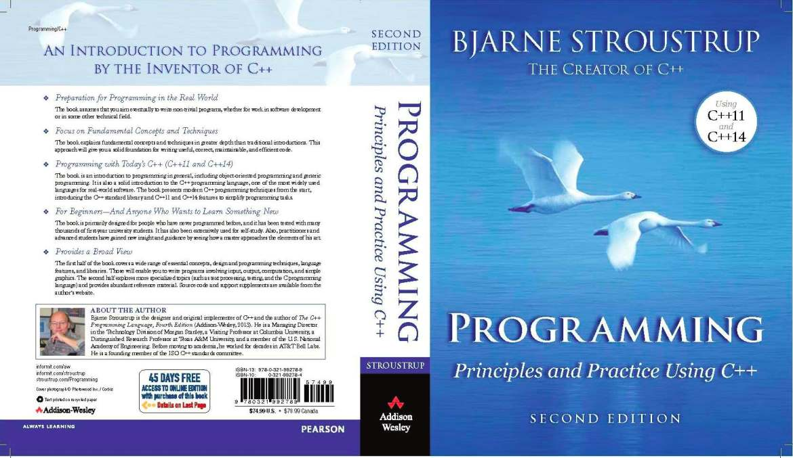

# cpp_book1
  

  

  
Exercises based on Bjarne Stroustrup's [Programming: Principles and Practice Using C++ (2nd Edition)](https://www.stroustrup.com/programming.html)
  
Legend:
3_x_2 = chapter number + type of task (t: try this, d: drill, x: exercise) + number of the task
  